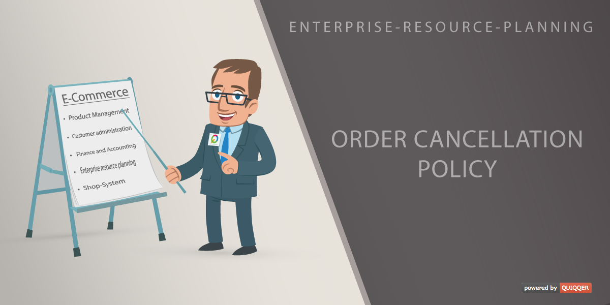

ERP Order revocation instruction (cancellation policy)
========

This module is for shops in Europe that sell to private customers. 
With this module it is possible to indicate a cancellation policy for certain areas.

The revocation instruction is a instruction about the right of revocation 
of a consumer with certain consumer contracts.

The EU Consumer Rights Directive harmonised the formal requirements 
for a proper revocation instruction as of 13 June 2014 throughout the EU. 
The legal uncertainty in connection with the German government's sample revocation 
instruction issued under the German Civil Code Info Ordinance (BGB-InfoV) 
has been a thing of the past ever since.

Package name:

    order-cancellation-policy

Features
--------

- Add an order revocation instruction to the order process
- Set up an order revocation instruction for specific areas

Installation
------------

The package name is: `quiqqer/order-cancellation-policy`

Contribute
----------
- Project: https://dev.quiqqer.com/quiqqer/order-cancellation-policy
- Issue Tracker: https://dev.quiqqer.com/quiqqer/order-cancellation-policy/issues
- Source Code: https://dev.quiqqer.com/quiqqer/order-cancellation-policy/tree/master
- Wiki: https://dev.quiqqer.com/quiqqer/order-cancellation-policy/wikis/home

Support
-------

If you found any flaws, have any wishes or suggestions you can send an email
to [support@pcsg.de](mailto:support@pcsg.de) to inform us about your concerns.  
We will try to respond to your request and forward it to the responsible developer.

License
-------

- GPL-3.0+
