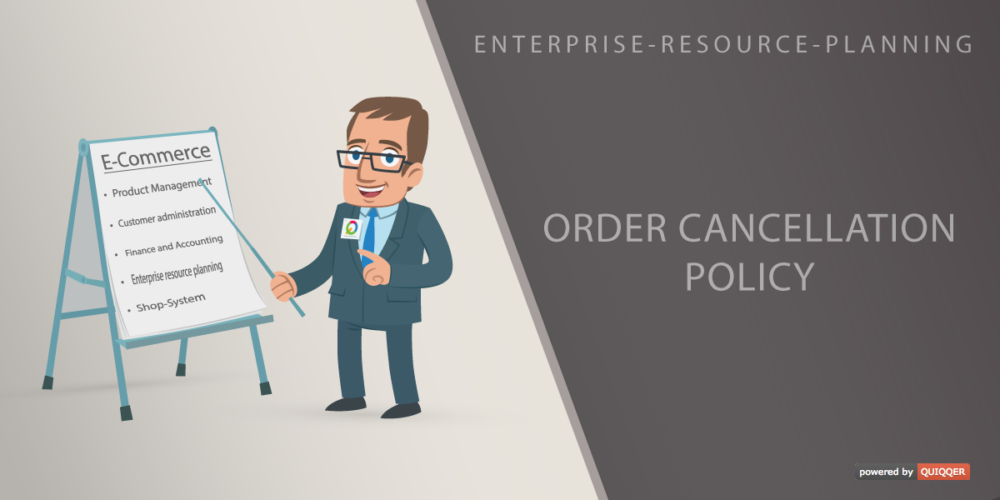

# QUIQQER Order Cancellation Policy

This package adds cancellation policy support for QUIQQER shops that sell to
private customers in Europe. It lets administrators enable cancellation policy
handling for selected ERP areas and provides a reusable frontend cancellation
form for customer requests.

## Features

- Adds cancellation policy text to the order checkout process.
- Enables cancellation policy handling per ERP area.
- Provides a frontend page type for cancellation form submissions.
- Sends cancellation form requests by email.
- Optionally protects the frontend form with `quiqqer/captcha`.

## Installation

Install the package through Composer:

```shell
composer require quiqqer/order-cancellation-policy
```

Run the QUIQQER package setup after installation.

## Configuration

Open the package settings in the QUIQQER administration to configure:

- the recipient email address for cancellation form requests,
- whether CAPTCHA protection is enabled,
- optional intro and success text for the frontend form,
- the ERP areas where cancellation policy handling is active.

Create a page with the `Cancellation form` page type to expose the reusable
frontend cancellation form.

## Technical Notes

The package stores cancellation form submissions in its package table and sends
the request details to the configured recipient. The CAPTCHA integration uses
the shared `quiqqer/captcha` control when that package is installed and enabled.

## Support

- Issues: https://dev.quiqqer.com/quiqqer/order-cancellation-policy/issues
- Source: https://dev.quiqqer.com/quiqqer/order-cancellation-policy
- Email: support@pcsg.de

## License

GPL-3.0-or-later
